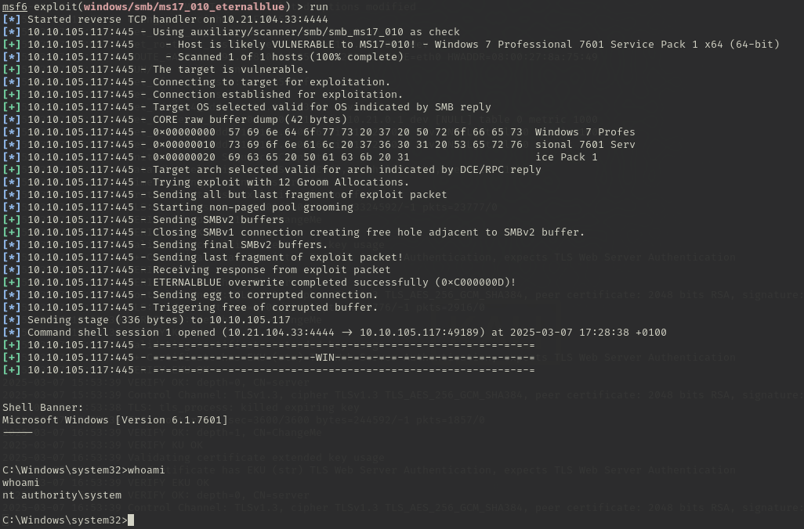

# 1 - Blue

- **Dificultad:** Fácil

## Herramientas Utilizadas

- Nmap
- Metasploit
- Hashcat

## Reconocimiento

### Escaneo de Puertos

1. Escanear la dirección ip con un escaneo simple

2. Escanear los puertos encontrados con un escaneo mas agresivo 

Con esto podemos saber que se trata de una maquina con Windows 7.

3. Lanzar un escaneo para detectar posibles vulnerabilidades

Con esto podemos ver que la maquina es vulnerable al exploit **ms17-010**.

## Explotación

Para la explotación usare la herramienta Metasploit.

### MS17-010

1. Buscar el exploit en Metasploit

2. Configurar los parámetros y el payload del exploit y lanzarlo

## Escalada de Privilegios

### Método Utilizado

Para escalar privilegios mejorar la shell a una de meterpreter.

### Proceso de Escalada

1. Buscar información de que modulo usar para mejorar la shell

2. Cargar, configurar y lanzar el modulo

Esto crea una nueva sesión con la shell de meterpreter. 

3. Mirar proceso para escalar privilegios

Listar los procesos con ps y migrar el proceso a uno que se este ejecutando como NT AUTHORITY/SYSTEM

Migro el proceso al proceso con id 668 ya que gestiona los servicios del sistema y es crucial para su funcionamiento.

## Dumpeo

Obtener la contraseña del usuario no predeterminado y romperla

## Proceso

1. Ver los hashes de las contraseñas del sistema 

2. Romper la contraseña

Para romper la contraseña usamos la herramienta Hashcat

## Flags

1. Flag 1

La primera flag se encuentra en el directorio root

2. Flag 2

La segunda flag se encuentra donde se guardan las contraseñas en Windows, es decir, el directorio donde se encuentra el archivo SAM

3. Flag 3

La tercera flag se encuentra en el directorio de documentos del usuario

---

---

Writeup hecho por Víctor Jiménez Corada