# 2 - ICE

**Plataforma:** TryHackMe
**Dificultad:** Fácil
**OS:** Windows

## Herramientas Utilizadas

- Nmap
- Metasploit

## Reconocimiento

### Escaneo de Puertos

- 1 . Escanear la dirección ip con un escaneo simple

  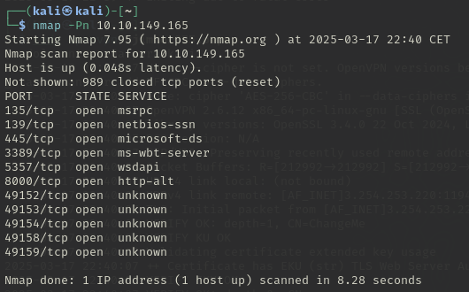

- 2 . Escanear los puertos encontrados con un escaneo mas agresivo

  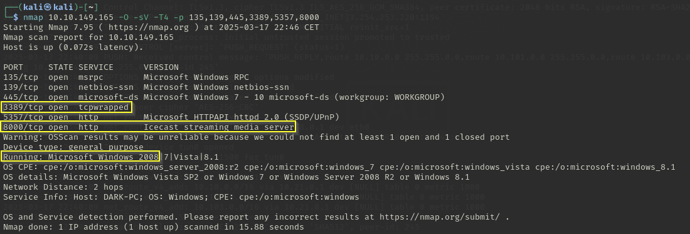

  Con esto podemos saber que se trata de una maquina con Windows Server 2008 y algunos servicios interesantes que se están ejecutando.

Investigando sobre Icecast descubrimos la siguiente [vulnerabilidad](https://www.cvedetails.com/cve/CVE-2004-1561/):

## Explotación

### Vulnerabilidad 1

Explotaremos la vulnerabilidad a través de Metasploit.

### Proceso de Explotación

- 1 . Buscar el exploit en Metasploit y cargarlo

  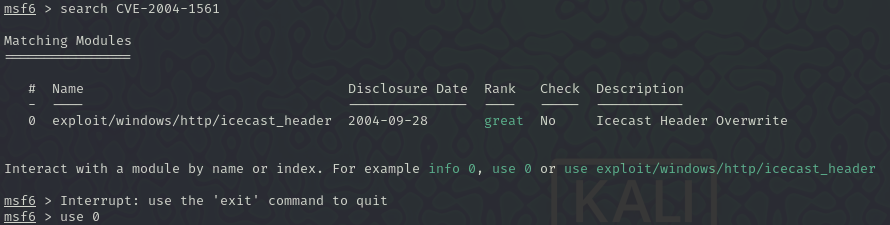

- 2 . Configurar el exploit y lanzarlo

  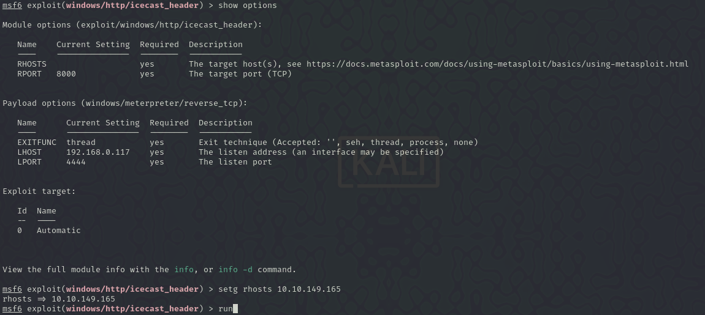

## Escalada de Privilegios

Al entrar vemos que estamos registrados como el usuario _Dark_.

### Método Utilizado

Lanzamos un segundo escaneo que nos revelara mas exploits que podremos usar para escalar privilegios

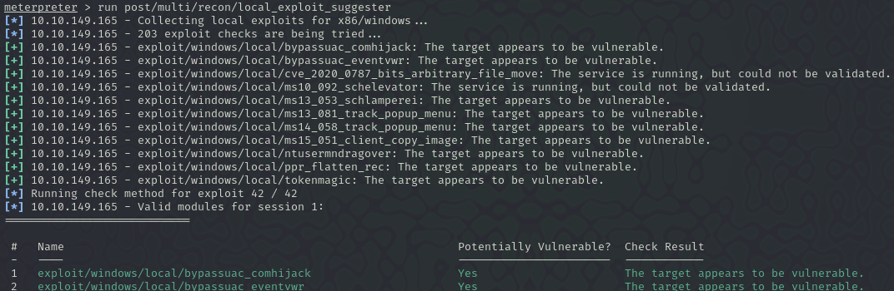

### Proceso de Escalada

- 1 . Cargamos el segundo exploit que se muestra, configuramos el numero de sesion de nuestra shell y lo lanzamos

  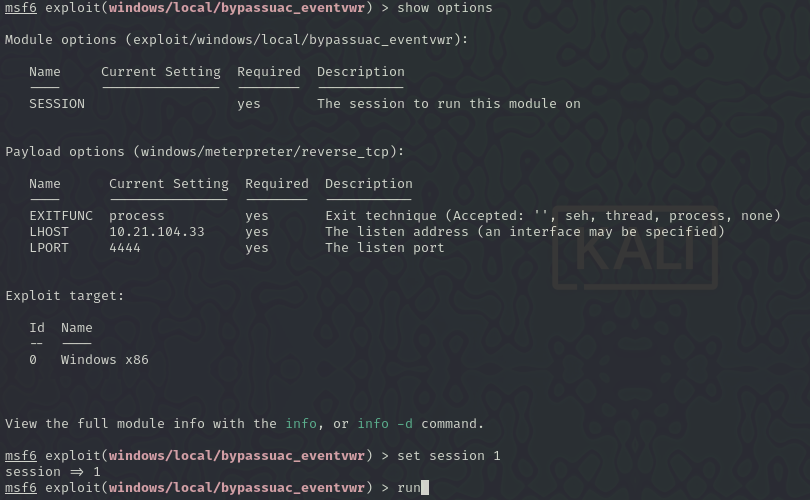

- 2 . Listar los procesos y migrarnos a uno con permisos de administrador

  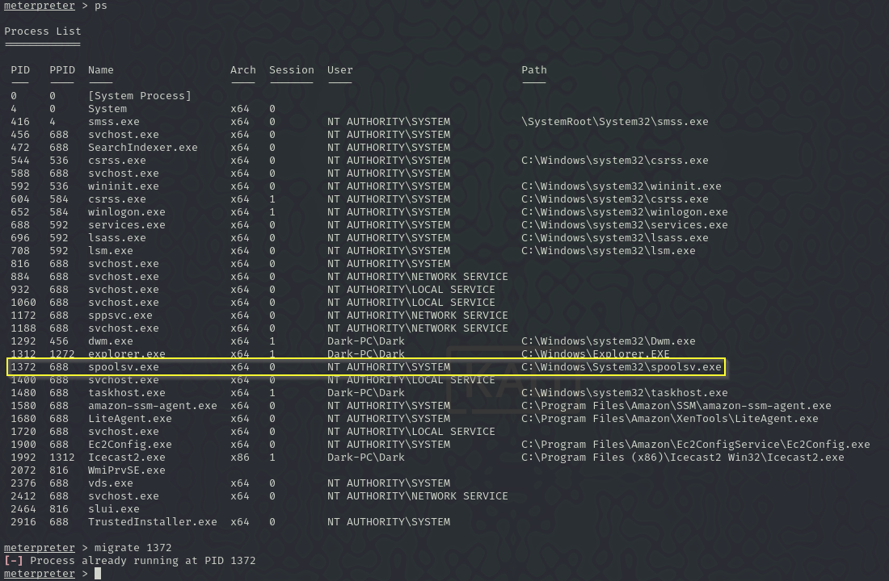

  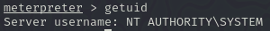

- 3 . Una vez somos administradores cargamos la herramienta kiwi para el volcado de contraseñas

  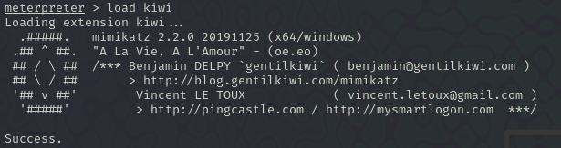
  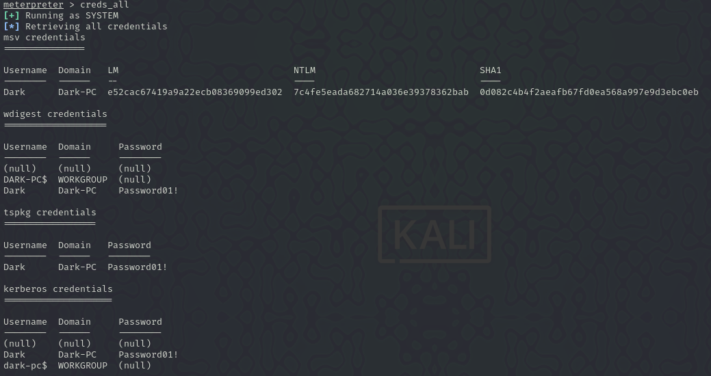

Una vez obtenida la contraseña del usuario _Dark_, podríamos acceder a ella desde un escritorio remoto.

...

## Flags

Sin flags

---

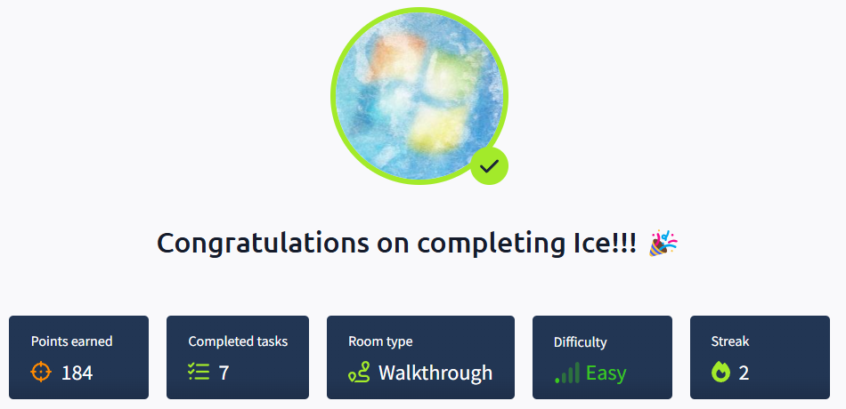

---

Writeup hecho por Víctor Jiménez Corada
