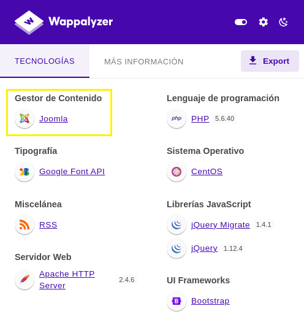
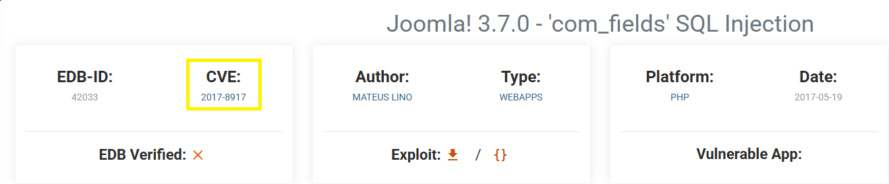
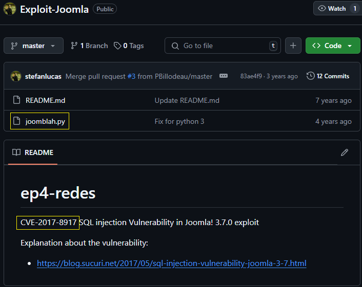
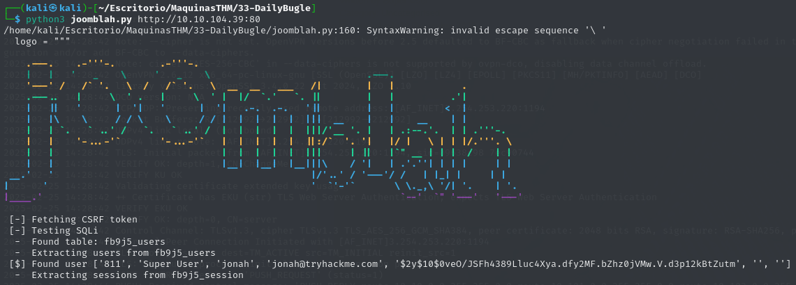

# 28 - Daily Bugle

## Escaneo de puertos

- Escaneo simple

```
sudo nmap 10.10.104.39 -sN
```


- Escaneo agresivo

```
sudo nmap 10.10.104.39 -A -T4 -p 22 80 3306
```


## Web

Al usar el addon Wappalyzer se puede ver que el gestor de contenidos de la pagina es Joomla:



Obtener versión de Joomla a través de la herramienta **Joomscan**:

```
joomscan -u http://10.10.104.39
```


Buscando vulnerabilidades para la versión 3.7.0 de Joomla encuentro la siguiente entrada en [exploit-db.com](https://www.exploit-db.com/):



Buscando el CVE en internet llego al siguiente [repositorio](https://github.com/stefanlucas/Exploit-Joomla):



Descargo el script de Python y exploto la vulnerabilidad:


